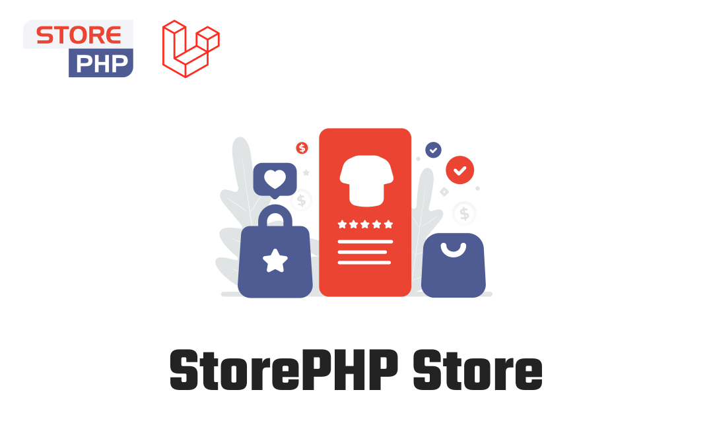

<p align="center"><a href="#" target="_blank"></a></p>

<p align="center">
  <a href="https://packagist.org/packages/storephp/framework" target="_blank"></a>
  <a href="https://packagist.org/packages/storephp/framework" target="_blank"></a>
</p>

# StorePHP Store

StorePHP you can build your online store.

## Documentation

```bash
composer create-project storephp/store

php artisan migrate
php artisan store:setup
php artisan sp:bundler:setup
php artisan serve
```

And Go to http://127.0.0.1:8000/storephp

The official document is being prepared now and will be launched soon.

## Contributing

Thank you for considering contributing to this package! Be one of the StorePHP team.

## License

This package is an open-sourced software licensed under the [MIT license](https://opensource.org/licenses/MIT).
